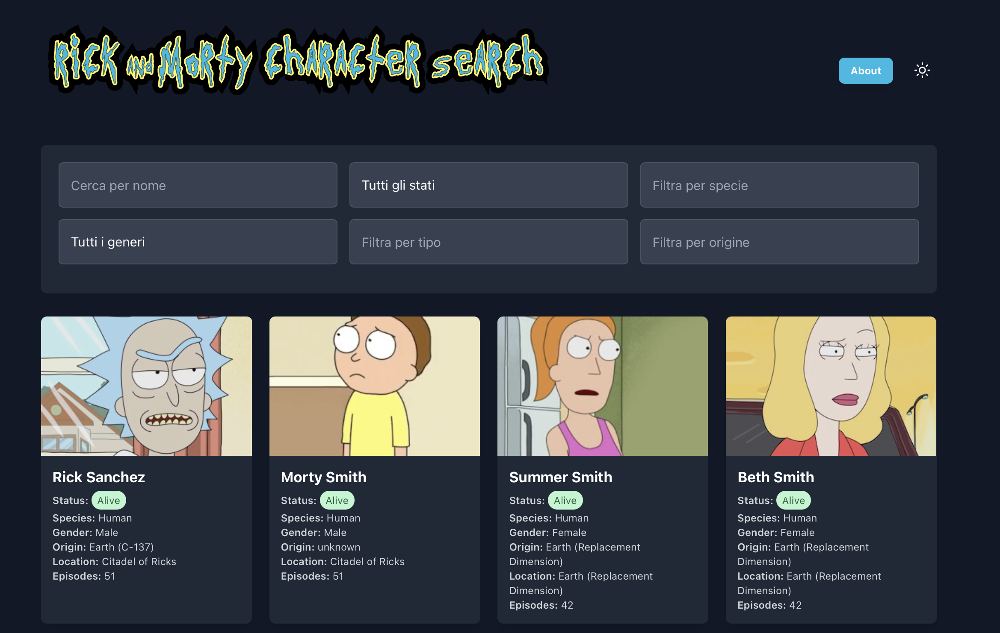

<div align="center">

# 🌌 Rick and Morty Character Search 🔍

[](https://choosealicense.com/licenses/mit/)
[](https://reactjs.org/)
[](https://tailwindcss.com/)
[](http://makeapullrequest.com)

<p align="center">
  
</p>

### 🚀 Explore the Multiverse of Rick and Morty Characters! 

[Live Demo](https://your-demo-link.com) | [Report Bug](https://github.com/yourusername/RickandMortySearch/issues) | [Request Feature](https://github.com/yourusername/RickandMortySearch/issues)

</div>

## ✨ Overview

Get schwifty with this React-based web application that lets you explore the vast multiverse of Rick and Morty! Search and filter through hundreds of characters from the show, with a sleek interface that works seamlessly across all devices.

## 🎯 Key Features

<details>
<summary>🔍 Advanced Search & Filtering</summary>

- Real-time character search
- Multi-parameter filtering:
  - Status (Alive/Dead/Unknown)
  - Species
  - Gender
  - Type
  - Origin Location
</details>

<details>
<summary>🎨 User Experience</summary>

- Responsive design for all devices
- Dark/Light mode toggle
- Smooth animations with Framer Motion
- Intuitive pagination
- Graceful error handling
</details>

## 🛠️ Built With

- ⚛️ **React** - UI Framework
- 🎨 **Tailwind CSS** - Styling
- ✨ **Framer Motion** - Animations
- 🔌 **Rick and Morty API** - Data Source
- 📦 **Lucide React** - Icons

## 🚀 Quick Start

1️⃣ **Clone & Install**
```bash
git clone https://github.com/yourusername/RickandMortySearch.git && cd RickandMortySearch && npm install
```

2️⃣ **Launch**
```bash
npm start
```

🌐 Visit `http://localhost:3000` - You're ready to explore the multiverse!

## 💡 Contributing

"Nobody exists on purpose. Nobody belongs anywhere. Everybody's gonna die. Come contribute to our project."

1. 🍴 Fork the Project
2. 🌱 Create your Feature Branch (`git checkout -b feature/AmazingFeature`)
3. 💫 Commit your Changes (`git commit -m 'Add some AmazingFeature'`)
4. 🚀 Push to the Branch (`git push origin feature/AmazingFeature`)
5. 🎉 Open a Pull Request

### 📋 Development Guidelines

```javascript
const goodContributor = {
  followStyle: true,
  writeTests: true,
  updateDocs: true,
  makeImpact: true
};
```

## 🐛 Bug Reports

Found a bug? Let's squanch it! Open an issue with:
- 📝 Clear description
- 🔄 Reproduction steps
- 💭 Expected behavior
- 📸 Screenshots (if applicable)

## 🚀 Roadmap

- [ ] 📺 Episode details and filtering
- [ ] 🔐 User authentication
- [ ] ❤️ Favorite characters feature
- [ ] 🔄 Character comparison
- [ ] 🎯 Advanced filtering options
- [ ] ♿ Accessibility improvements

## 📄 License

Distributed under the MIT License. See `LICENSE` for more information.

## 💖 Acknowledgments

- 🌟 [Rick and Morty API](https://rickandmortyapi.com/) for the amazing data
- 🚀 React community for the incredible tools
- 👥 All our contributors

## 📬 Contact

Nannipy - [GitHub](https://github.com/yourusername)

---

<div align="center">
  
  <br>
  "Wubba Lubba Dub Dub!" - Rick Sanchez
</div>
